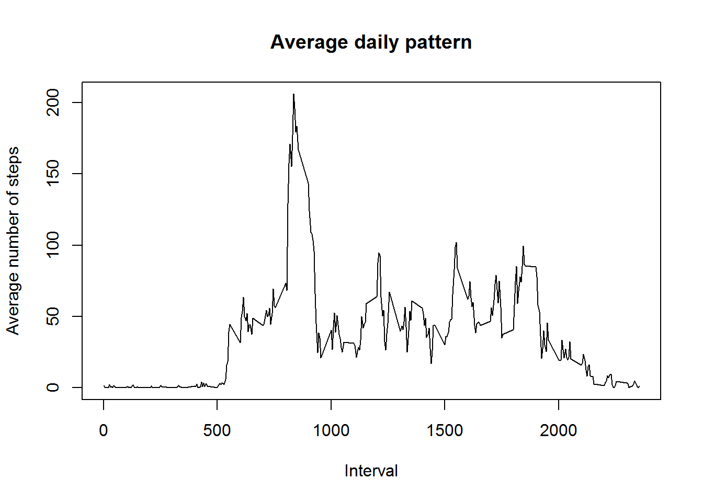

```r
library(stats)
library(ggplot2)
library(base)
```

## Loading and preprocessing the data


```r
data_activity <- read.csv("activity.csv")

data_activity$date <- as.Date(data_activity$date)
data_activity$day_num <- data_activity$interval %/% 100
data_activity$interval_num <- data_activity$interval %% 100
```
  
  
## Histogram of total number of steps per day 


```r
ag <- aggregate(steps~date,data = data_activity,sum)
ggplot(data = ag) +
geom_histogram(aes(steps),bins = 10,fill = 'red',color = 'black')+
theme(text = element_text(size=10))+
xlab("Steps per day") +
ylab("Frequency") + 
ggtitle("Histogram of total steps per day")
```


  
  
## What is mean and median total number of steps taken per day?


```r
mean_num <- round(mean(ag$steps))
median_num <- median(ag$steps)
```

The mean number of steps per day is 10766  
The median number of steps per day is 10765

  
  
## What is the average daily activity pattern?


```r
ag_by_int <- aggregate(steps~interval,data = data_activity,mean)
plot(ag_by_int$interval,ag_by_int$steps,type = 'l',
     xlab = "Interval",ylab = "Average number of steps",
     main = "Average daily pattern")
```




## Which five-minute interval contains maximum number of steps


```r
max_steps_by_int <- max(ag_by_int$steps)
interval_max_steps <- ag_by_int[(ag_by_int$steps == max_steps_by_int),]
interval_max_steps <- interval_max_steps$interval
```

### The interval 835 contains maximum number of steps  


## Imputing missing values  


```r
num_na <- sum(!complete.cases(data_activity))
```
### The number of rows with NAs is 2304  

Using the mean of the corresponding 5-minute interval to impute missing values


```r
data_imputed <- transform(data_activity,steps = ifelse(is.na(data_activity$steps),
                                                ag_by_int$steps[match(data_activity$interval,ag_by_int$interval)],
                                                data_activity$steps))

data_imputed$steps <- round(data_imputed$steps)
```
  


```r
ag_imputed <- aggregate(steps~date,data = data_imputed,sum)
ggplot(data = ag_imputed) +
geom_histogram(aes(steps),bins = 10,fill = 'red',color = 'black')+
theme(text = element_text(size=10))+
xlab("Steps per day") +
ylab("Frequency") + 
ggtitle("Histogram of total steps per day")
```


  
  
## What is mean and median total number of steps taken per day, after imputing?


```r
mean_num_imputed <- round(mean(ag_imputed$steps))
median_num_imputed <- median(ag_imputed$steps)
```

  
After imputation,    
The mean number of steps per day is 10766    
The median number of steps per day is 10762  


```r
diff_mean <- abs(mean_num_imputed - mean_num)
diff_median <- abs(median_num_imputed - median_num)
diff_total <- sum(data_imputed$steps) - sum(data_activity$steps, na.rm = TRUE)
```

Difference between imputed mean and normal mean is 0  
Difference between imputed median and normal median is 3  
Difference between total number of steps in imputed and non-imputed data is 86096  


Hence, The total number of steps increased by 86096 after imputation.  


## Are there differences in activity patterns between weekdays and weekends?

Creating a new factor 'day' describing if the day is a weekday or a weekend


```r
data_weekend <- within(data_imputed,
                       {day <- ifelse(weekdays(data_imputed$date) %in% c("Saturday","Sunday"),"Weekend","Weekday")})

data_weekend$day <- as.factor(data_weekend$day)
```


Making a panel plot of the steps taken over the 5-minute intervals averaged across weekdays and weekends


```r
ag_dayofweek <- aggregate(steps~interval+day,data = data_weekend,mean)
ggplot(data = ag_dayofweek) +
geom_line(aes(interval,steps,group=1,color=day))+
theme(text = element_text(size=10))+
facet_grid(day~.) +
xlab("Interval") +
ylab("Number of Steps") + 
ggtitle("Number of steps by interval on weekdays and weekends")
```


